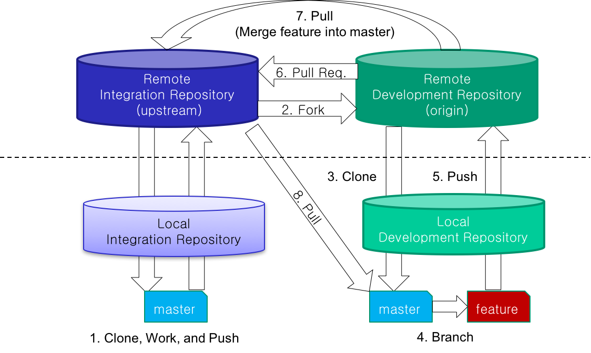

# HRI-20069-W2-fork

## Integration-Manager Workflow
Assume that there are an integrator (I) and a developer (D1)

1. [I]: Make a **Remote Integration Repository** (R_I_Repo), clone to Local Integration Repository (L_I_Repo), work at local, and push.
2. [D1]: **Fork** the R_I_Repo into a Remote Development1 Repository (R_D1_Repo)
3. [D1]: **Clone** to Local D1 Repository (L_D1_Repo).
3. [D1]: Make a **Branch** (such as *feature_D1*) at local.
4. [D1]: **Work** in the *feature_D1* branch and **Push** to R_D1_Repo.
5. [D1]: Make a **Pull Request** to Integrator's R_I_Repo.
6. [I]: Investigate the branch *feature_D1* and **Merge** in it into the mater branch at R_I_Repo and pull to the local master branch of L_I_Repo.
7. [D1]: **Pull** the R_I_Repo: ```$ git remote add upstream <url_of_R_I_Repo>``` and ```$ git pull upstream master``` to keep the local master branch synchronized with R_I_Repo.


